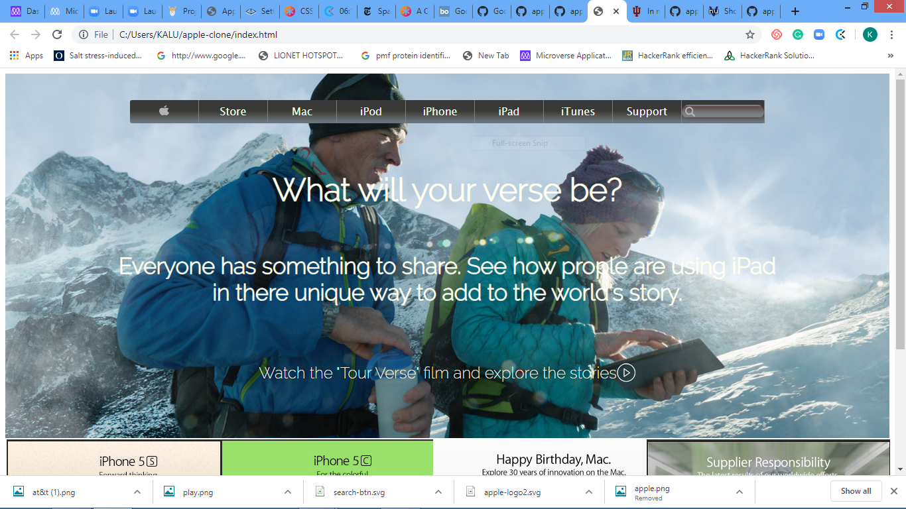
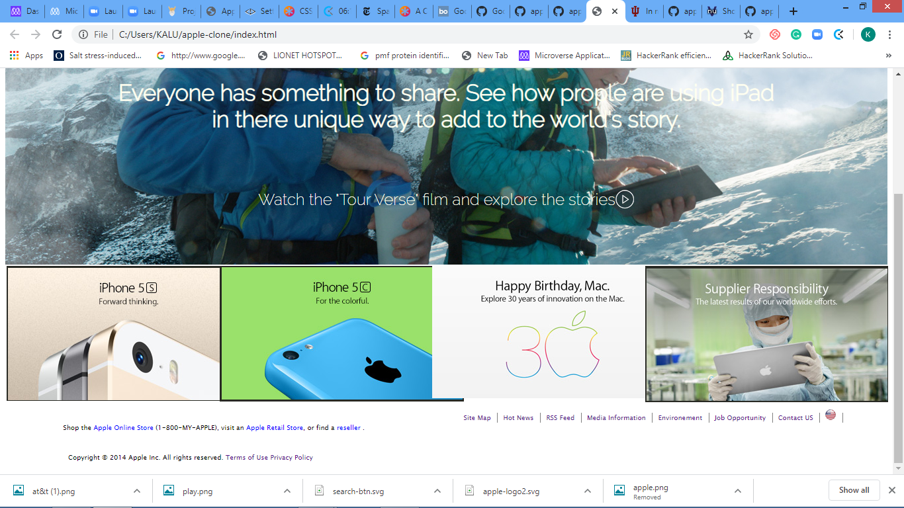

# Apple Clone

This is a clone application of archived apple website.
 
 
 
 
 
In this project, my main aim was to learn how to align elements with float, flex and grid in CSS. I tried doing it by creating an application that looks like the archived apple.com website.

## Built with
  * HTML 
  * CSS (Box Model, Float, Grid, Flex and Positioning)
  * Lint (Stickler)
  * W3C Validator

## Live demo
https://rawcdn.githack.com/Godswilly/apple-clone/1fba26c23a94d3c2d6df5702a57ad885bbe18a2a/index.html

## Getting started
**I cloned an archived copy of Apple website. The main aim is to ensure the elements get placed and styled roughly the same way as the source, so functionality is not a priority.**

I used the browser’s developer tools to inspect the real Apple archive web page to understand how elements are placed and styled.
I built my own page in a .html text file and opened it in our browser to check it out. We carried out the following steps:
  - First setup a github repository for the project.
  - Then create a .html file where all our HTML markup will go
  - Create a .css file where all our styling code will reside

## Author
 :bust_in_silhouette:
 * Github: https://github.com/Godswilly
 * LinkedIn: https://www.linkedin.com/in/kalu-agu-kalu/
 * Twitter: https://twitter.com/KaluAguKalu17

## Contributing
Contributions, issues and feature requests are welcome!

   1. Fork the Project
   2. Create your Feature Branch (git checkout -b feature/AmazingFeature)
   3. Commit your Changes (git commit -m 'Add some AmazingFeature')
   4. Push to the Branch (git push origin feature/AmazingFeature)
   5. Open a Pull Request

## Show your support
Give a :star: if you like this project!

## Acknowledgements
  * [Microverse](https://www.microverse.org/)
  * [The Odin Project](https://www.theodinproject.com/courses/html5-and-css3/lessons/embedding-images-and-video#introduction)

## License
 Distributed under the MIT License.